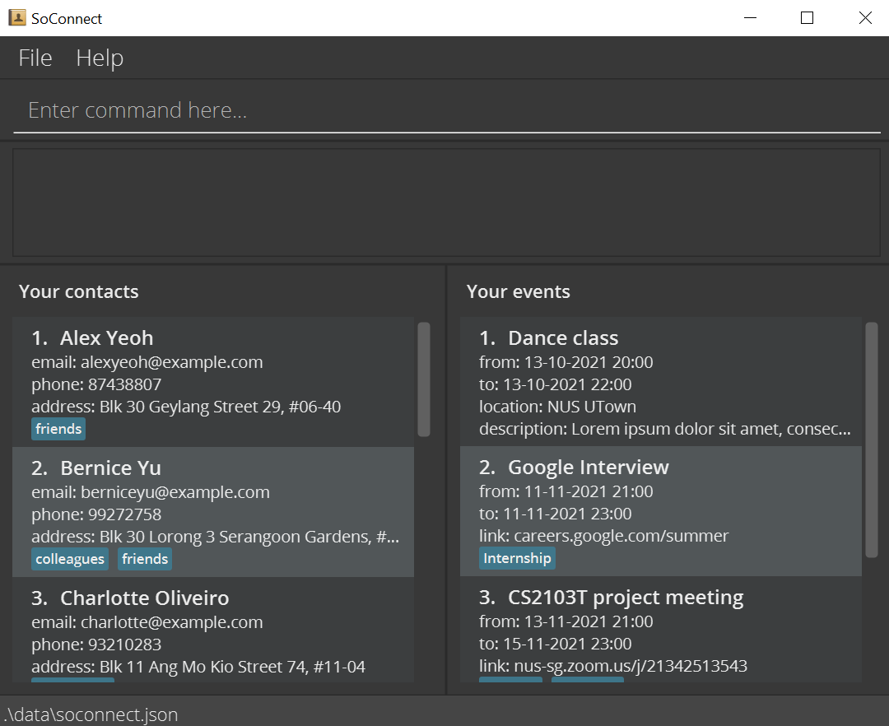

## Introduction
SoConnect is a desktop application for students :man_technologist::woman_technologist: in [NUS School of Computing](https://www.comp.nus.edu.sg/)
to **manage the contacts** of their professors and tutors, and **keep track of** their busy schedule of **events**.

## Usage
- Add, delete, view contact information of professors
  - Save email addresses, zoom links, office locations and more!
- Add, delete, view events
  - Check upcoming events
  - [Future implementation] Link events to other contacts as participants!
- View the detailed documentation of this project at our [user guide](https://ay2122s1-cs2103t-w15-3.github.io/tp/UserGuide.html)

## Acknowledgement

This project is based on the AddressBook-Level3 project created by the [SE-EDU initiative](https://se-education.org).

If you would like to contribute code to other SE-EDU projects, see [se-education.org](https://se-education.org#https://se-education.org/#contributing) for more info.
