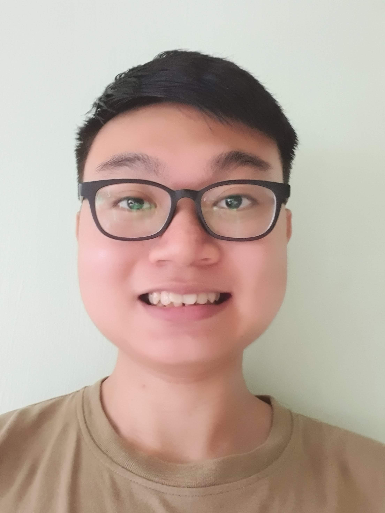
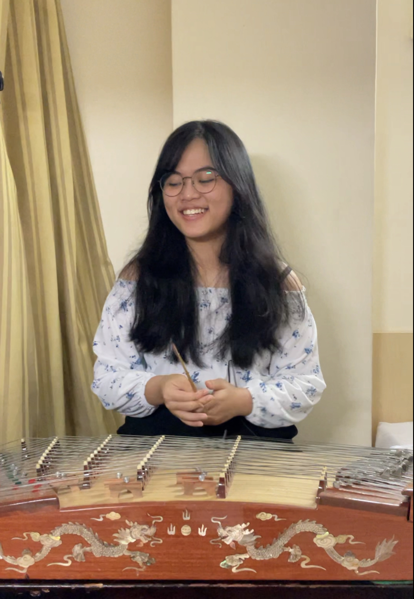
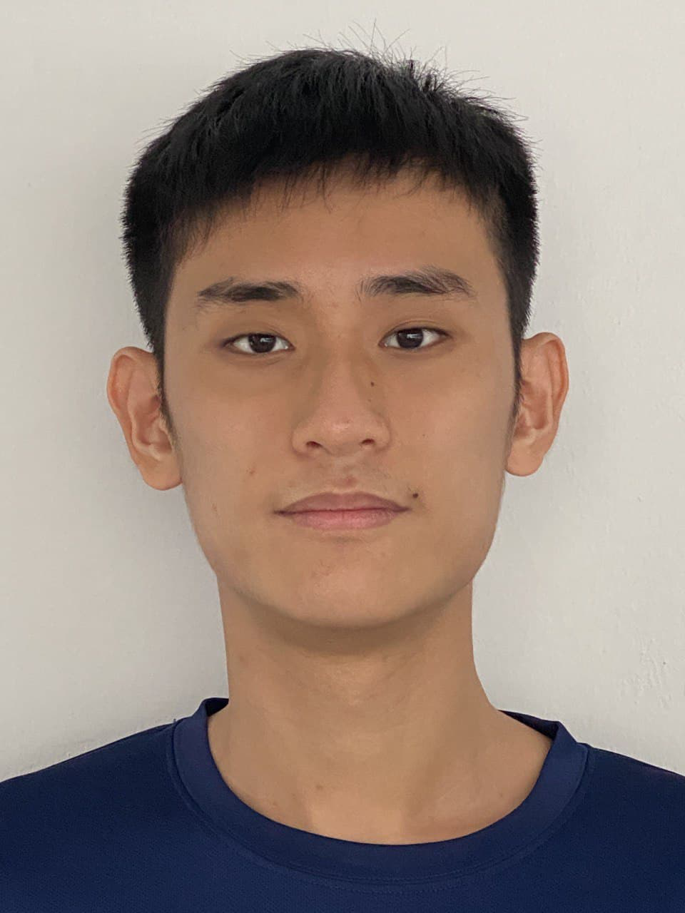

We are a team based in the [School of Computing, National University of Singapore](http://www.comp.nus.edu.sg).

## Project team

### Gordon Yit Hongyao

[[github](http://github.com/gordon25)]
[[portfolio](team/gordon25.md)]

* Role: Documentation, Scheduling and Tracking
* Responsibilities: Storage

### Janice Chen

[[github](http://github.com/janjanchen)]
[[portfolio](team/janjanchen.md)]

* Role: Code Quality
* Responsibilities: Model

### Lee Chun Wei

[[github](http://github.com/chunweii)]
[[portfolio](team/chunweii.md)]

* Role: Team Lead, Deliverables and Deadlines
* Responsibilities: UI

### Ng Xiang Jun

[[github](http://github.com/xiangjunn)]
[[portfolio](team/xiangjunn.md)]

* Role: Integration
* Responsibilities: UI

### Pham Chau Giang

[[github](http://github.com/pcgiang)]
[[portfolio](team/pcgiang.md)]

* Role: Testing
* Responsibilities: Model
