* Table of Contents
{:toc}

--------------------------------------------------------------------------------------------------------------------

## **Acknowledgements**

* {list here sources of all reused/adapted ideas, code, documentation, and third-party libraries -- include links to the original source as well}

--------------------------------------------------------------------------------------------------------------------

## **Setting up, getting started**

Refer to the guide [_Setting up and getting started_](SettingUp.md).

--------------------------------------------------------------------------------------------------------------------

## **Design**

:bulb: **Tip:** The `.puml` files used to create diagrams in this document can be found in the [diagrams](https://github.com/AY2122S1-CS2103T-W15-3/tp/tree/master/docs/diagrams/) folder. Refer to the [_PlantUML Tutorial_ at se-edu/guides](https://se-education.org/guides/tutorials/plantUml.html) to learn how to create and edit diagrams.

### Architecture

The ***Architecture Diagram*** given above explains the high-level design of the SoConnect App.

Given below is a quick overview of main components and how they interact with each other.

**Main components of the architecture**

**`Main`** has two classes called [`Main`](https://github.com/AY2122S1-CS2103T-W15-3/tp/tree/master/src/main/java/seedu/address/Main.java) and [`MainApp`](https://github.com/AY2122S1-CS2103T-W15-3/tp/tree/master/src/main/java/seedu/address/MainApp.java). It is responsible for,
* At app launch: Initializes the components in the correct sequence, and connects them up with each other.
* At shut down: Shuts down the components and invokes cleanup methods where necessary.

[**`Commons`**](#common-classes) represents a collection of classes used by multiple other components.

The rest of the App consists of four components.

* [**`UI`**](#ui-component): The UI of the SoConnect app.
* [**`Logic`**](#logic-component): The command executor.
* [**`Model`**](#model-component): Holds the data of the app in memory.
* [**`Storage`**](#storage-component): Reads data from, and writes data to, the hard disk.

**How the architecture components interact with each other**

The *Sequence Diagram* below shows how the components interact with each other for the scenario where the user issues the command `edelete 1`.

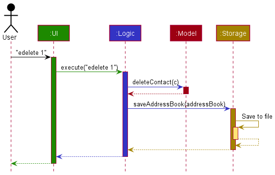

Each of the four main components (also shown in the diagram above),

* defines its *API* in an `interface` with the same name as the Component.
* implements its functionality using a concrete `{Component Name}Manager` class (which follows the corresponding API `interface` mentioned in the previous point.

For example, the `Logic` component defines its API in the `Logic.java` interface and implements its functionality using the `LogicManager.java` class which follows the `Logic` interface. Other components interact with a given component through its interface rather than the concrete class (reason: to prevent outside component's being coupled to the implementation of a component), as illustrated in the (partial) class diagram below.

The sections below give more details of each component.

### UI component

The **API** of this component is specified in [`Ui.java`](https://github.com/AY2122S1-CS2103T-W15-3/tp/blob/master/src/main/java/seedu/address/ui/Ui.java)

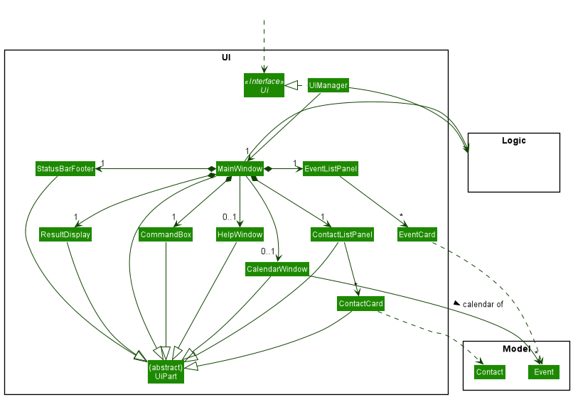

The UI consists of a `MainWindow` that is made up of parts e.g.`CommandBox`, `ResultDisplay`, `ContactListPanel`, `StatusBarFooter` etc. All these, including the `MainWindow`, inherit from the abstract `UiPart` class which captures the commonalities between classes that represent parts of the visible GUI.

The `UI` component uses the JavaFx UI framework. Only the `CalendarWindow` component uses the [CalendarFX](https://github.com/dlsc-software-consulting-gmbh/CalendarFX) dependency. The layout of these UI parts are defined in matching `.fxml` files that are in the `src/main/resources/view` folder. For example, the layout of the [`MainWindow`](https://github.com/AY2122S1-CS2103T-W15-3/tp/blob/master/src/main/java/seedu/address/ui/MainWindow.java) is specified in [`MainWindow.fxml`](hhttps://github.com/AY2122S1-CS2103T-W15-3/tp/blob/master/src/main/resources/view/HelpWindow.fxml)

The `UI` component,

* executes user commands using the `Logic` component.
* listens for changes to `Model` data so that the UI can be updated with the modified data.
* keeps a reference to the `Logic` component, because the `UI` relies on the `Logic` to execute commands.
* depends on some classes in the `Model` component, as it displays `Contact` and `Event` objects residing in the `Model`.

### Logic component

**API** : [`Logic.java`](https://github.com/AY2122S1-CS2103T-W15-3/tp/tree/master/src/main/java/seedu/address/logic/Logic.java)

Here's a (partial) class diagram of the `Logic` component:

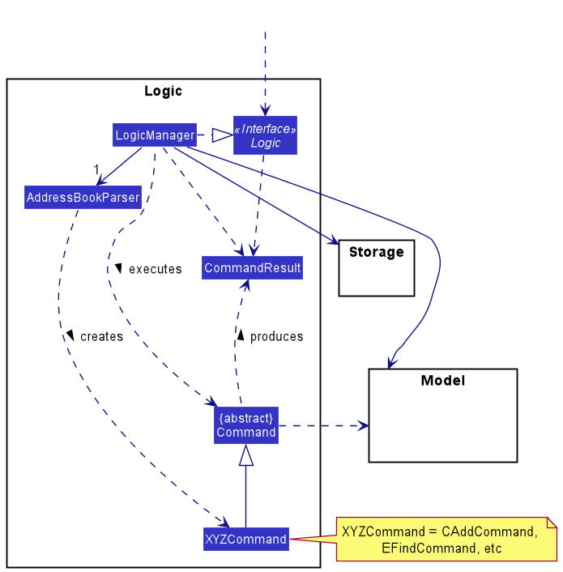

How the `Logic` component works:
1. When `Logic` is called upon to execute a command, it uses the `AddressBookParser` class to parse the user command.
1. This results in a `Command` object (more precisely, an object of one of its subclasses e.g., `AddCommand`) which is executed by the `LogicManager`.
1. The command can communicate with the `Model` when it is executed (e.g. to add a contact).
1. The result of the command execution is encapsulated as a `CommandResult` object which is returned back from `Logic`.

The Sequence Diagram below illustrates the interactions within the `Logic` component for the `execute("delete 1")` API call.

:information_source: **Note:** The lifeline for `DeleteCommandParser` should end at the destroy marker (X) but due to a limitation of PlantUML, the lifeline reaches the end of diagram.

Here are the other classes in `Logic` (omitted from the class diagram above) that are used for parsing a user command:

How the parsing works:
* When called upon to parse a user command, the `AddressBookParser` class creates an `XYZCommandParser` (`XYZ` is a placeholder for the specific command name e.g., `CAddCommandParser`) which uses the other classes shown above to parse the user command and create a `XYZCommand` object (e.g., `CAddCommand`) which the `AddressBookParser` returns back as a `Command` object.
* All `XYZCommandParser` classes (e.g., `CAddCommandParser`, `EDeleteCommandParser`, ...) inherit from the `Parser` interface so that they can be treated similarly where possible e.g, during testing.

### Model component
**API** : [`Model.java`](https://github.com/AY2122S1-CS2103T-W15-3/tp/tree/master/src/main/java/seedu/address/model/Model.java)

The `Model` component,

* stores the SoConnect data i.e., all `Contact` objects (which are contained in a `UniqueContactList` object) and all `Event` objects (which are contained in a `UniqueEventList` object).
* stores the currently 'selected' `Contact` and `Event` objects (e.g., results of a search query) as a separate _filtered_ list which is exposed to outsiders as an unmodifiable `ObservableList<Contact>` and `ObservableList<Event>` that can be 'observed' e.g. the UI can be bound to this list so that the UI automatically updates when the data in the lists change.
* stores a `UserPref` object that represents the user’s preferences. This is exposed to the outside as a `ReadOnlyUserPref` objects.
* does not depend on any of the other three components (as the `Model` represents data entities of the domain, they should make sense on their own without depending on other components)

:information_source: **Note:** An alternative (arguably, a more OOP) model is given below. It has a `Tag` list in the `AddressBook`, which `Contact` and ` Event` references. This allows `AddressBook` to only require one `Tag` object per unique tag, instead of each `Contact` or `Event` needing their own `Tag` objects. 
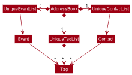

### Storage component

**API** : [`Storage.java`](https://github.com/AY2122S1-CS2103T-W15-3/tp/tree/master/src/main/java/seedu/address/storage/Storage.java)

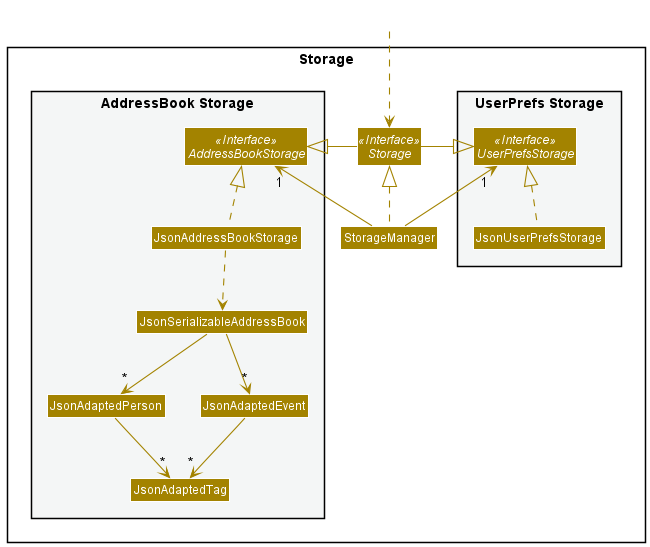

The `Storage` component,
* can save both address book data and user preference data in json format, and read them back into corresponding objects.
* inherits from both `AddressBookStorage` and `UserPrefStorage`, which means it can be treated as either one (if only the functionality of only one is needed).
* depends on some classes in the `Model` component (because the `Storage` component's job is to save/retrieve objects that belong to the `Model`)

### Common classes

Classes used by multiple components are in the `seedu.addressbook.commons` package.

--------------------------------------------------------------------------------------------------------------------

## **Implementation**

This section describes some noteworthy details on how certain features are implemented.

### Delete Events feature
This section details how an `Event` or multiple `Event` objects are deleted using the `edelete` command.

The `edelete` command allows users to delete a single or an inclusive range of consecutive events from the current event list shown on SoConnect.
Users needs to specify either an `Index` or a `Range` of event(s) to be deleted.
The deleted event(s) would be removed from the display of SoConnect GUI.

#### Implementation

We will use an example command: `edelete 1-3`.

The sequence diagram below shows how the execution of the example command flows:

:information_source: **Note:** The lifeline for `DeleteCommandParser` should end at the destroy marker (X) but due to a limitation of PlantUML, the lifeline reaches the end of diagram.

How `edelete` works:

Step 1: `LogicManager` executes user's input. `AddressBookParser` is used to realise it is a `edelete` command, creating a new `EDeleteCommandParser` object.

Step 2: `EDeleteCommandParser` object parses the input arguments and creates a `Range` object.

Step 3: `Range` object is used to construct a new `EDeleteCommand` object. `EDeleteCommand` object is then returned to `LogicManager`.

Step 4: `LogicManager` calls `execute` method of `EDeleteCommand`, which repeatedly deletes event from the most updated event list with index `1` for `3` times.

The event list will be updated to a new list after each delete. Deleting an inclusive range of events is done by repeatedly deleting the event from the start `Index` for `endIndex - startIndex + 1` times.

If the user only specified one `Index` for `edelete`, a `Range` object is created with the same start and end `Index`.

#### Design considerations:

**Aspect: Type of user inputs:**

* **Alternative 1 (current choice):** Either a single Index or a Range can be specified.
    * Pros: Easy to implement.
    * Cons: Unable to delete multiple ranges of events or events that are not ordered consecutively in the event list.

* **Alternative 2:** Allow a mixture of multiple single indexes and multiple ranges
    * Pros: Able to delete events more efficiently.
    * Cons: We must ensure that the order of delete of the events is correct. It is more complex to keep track of the events to be deleted.

### List Events feature

The EList feature is facilitated by `EListCommand`, `EListCommandParser` and `model`.

#### EList Command

`EList Command` class extends the `Command` abstract class. `EListCommand` class is tasked to list specific field(s) of
all events and creating a new `CommandResult` to be displayed to the user in the user interface.

`EListCommandParser`
`EListCommandParser` class extends `Parser` interface.
`EListCommandParser` class is tasked with parsing the user inputs and generate a new `EListCommand`.
The main logic of the elist feature is encapsulated here.

The `parse` method inside the `EListCommandParser` receives the user input, extracts the required prefix(es) and set which field(s) to be displayed based on the prefix(es) provided.
* If no prefix is provided, the `parse` method will set all fields of the `Event` class to be displayed.
* If one or more prefix(es) is / are provided, `parse` will set the corresponding field(s) to be displayed,
  sets the rest of the fields to be hidden.

`EListCommandParser#parse` method will then return an `EListCommand`

* If values of prefixes given are not empty, `EListCommandParser#parse` throws a ParseException.

-------------------------------------------------------
Given below is one example usage scenario and explains how the elist feature behaves at each step.

Example 1: List start and end times of all events.

Step 1. The user enters `elist at/ end/`.

Step 2. The command word `elist` is extracted out in `AddressBookBookParser`, and matches the `COMMAND_WORD` for `EListCommand` class.

Step 3. The remaining user input is the given to the `EListCommandParser` to determine if the user input contains the valid fields.

Step 4. Inside `EListCommandParser#parse()` method, the remaining user input `at/ end/`, will be subjected to checks by `EListCommandParser#anyPrefixValueNotEmpty()` and `argMultimap#getPreamble()#isEmpty()` methods.
* `EListCommandParser#anyPrefixValueNotEmpty()` returns true if the values of any prefix is not empty, returns false otherwise.
* `argMultimap#getPreamble()#isEmpty()` returns true if there is any input between the command word and the first prefix, returns false otherwise.

Step 5. The `EListCommandParser#parse()` method then proceeds to set `startDateTime` and `endDateTime` fields to be displayed as their prefix(es) `at/` and `end/` are provided. The other fields are set to be hidden.
`EListCommandParser` then creates and calls an `EListCommand` object.

Step 6. The `EListCommand#execute()` first checks if the `model` provided is not null.

Step 7. The `EListCommand#execute()` is then called by the `LogicManager`. In this method, it first hides all the
`Events` before showing each `Events` with only the event `name`, `start` and `end` timings displayed.

Step 8. A `CommandResult` with all events listed will be displayed to the user.

#### Sequence Diagram

The following sequence diagram shows how the `elist` feature works for Example 1:

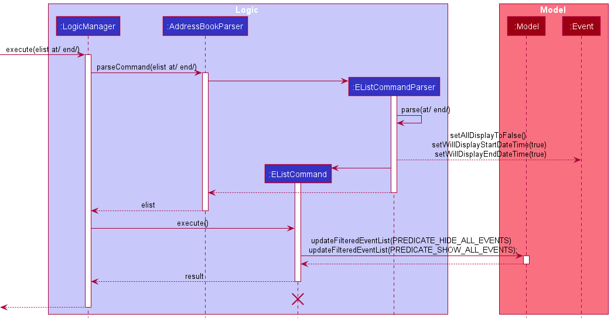

#### Activity Diagram

The following activity diagram summarizes what happens when the `elist` feature is triggered:

#### Design Consideration

#### Aspect: Allowing inputs for EListCommand.

* **Alternative (current implementation): EListCommand displays all fields.**
    * Pros: No need to check for valid prefixes.
    * Cons: User maybe interested in one field, but has to look through all the fields.

### Link Event feature

#### Implementation

The elink mechanism is facilitated by `ELinkCommandParser` which implements `Parser`, as well as `ELinkCommand`
which extends `Command`. `ELinkCommandParser` is responsible for parsing user inputs and ensuring that
the inputs are valid. `ELinkCommand` is responsible for the execution of elink  mechanism to link the event to the 
target contact.

The following operations are the main operations for elink mechanism.

- `ELinkCommandParser#parse` - Parse the user inputs and create a `ELinkCommand` to return.

- `ELinkCommand#execute` - Links the event to the target contact.

The following sequence diagram shows how the elink operation works:

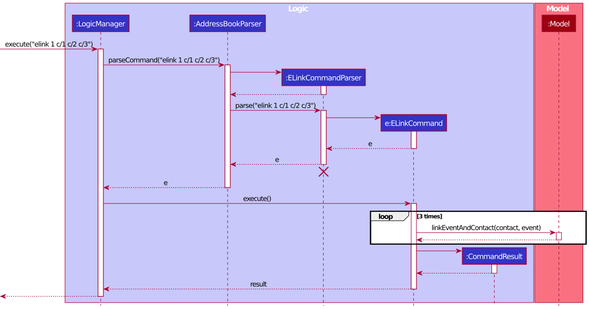

### Undo/redo feature

The undo/redo mechanism is facilitated by `VersionedAddressBook`. It extends `AddressBook` with an undo/redo history, stored internally as an `addressBookStateList` and `currentStatePointer`. Additionally, it implements the following operations:

* `VersionedAddressBook#commit()` — Saves the current address book state in its history.
* `VersionedAddressBook#undo()` — Restores the previous address book state from its history.
* `VersionedAddressBook#redo()` — Restores a previously undone address book state from its history.

These operations are exposed in the `Model` interface as `Model#commitAddressBook()`, `Model#undoAddressBook()` and `Model#redoAddressBook()` respectively.

Given below is an example usage scenario and how the undo/redo mechanism behaves at each step.

Step 1. The user launches the application for the first time. The `VersionedAddressBook` will be initialized with the initial address book state, and the `currentStatePointer` pointing to that single address book state.

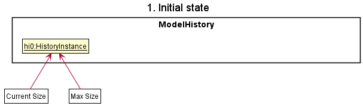

Step 2. The user executes `edelete 5` command to delete the 5th event in the event list. The `edelete` command calls `Model#commitAddressBook()`, causing the modified state of the address book after the `edelete 5` command executes to be saved in the `addressBookStateList`, and the `currentStatePointer` is shifted to the newly inserted address book state.

Step 3. The user executes `cadd n/David …​` to add a new contact. The `cadd` command also calls `Model#commitAddressBook()`, causing another modified address book state to be saved into the `addressBookStateList`.

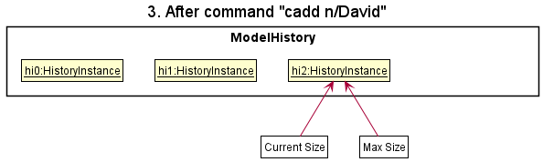

:information_source: **Note:** If a command fails its execution, it will not call `Model#commitAddressBook()`, so the address book state will not be saved into the `addressBookStateList`.

Step 4. The user now decides that adding the contact was a mistake, and decides to undo that action by executing the `undo` command. The `undo` command will call `Model#undoAddressBook()`, which will shift the `currentStatePointer` once to the left, pointing it to the previous address book state, and restores the address book to that state.

:information_source: **Note:** If the `currentStatePointer` is at index 0, pointing to the initial AddressBook state, then there are no previous AddressBook states to restore. The `undo` command uses `Model#canUndoAddressBook()` to check if this is the case. If so, it will return an error to the user rather
than attempting to perform the undo.

The following sequence diagram shows how the undo operation works:

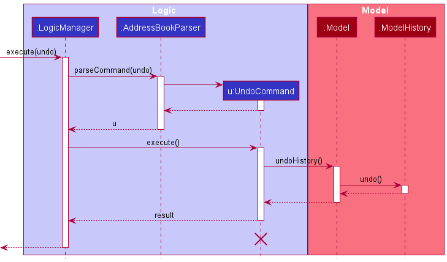

:information_source: **Note:** The lifeline for `UndoCommand` should end at the destroy marker (X) but due to a limitation of PlantUML, the lifeline reaches the end of diagram.

The `redo` command does the opposite — it calls `Model#redoAddressBook()`, which shifts the `currentStatePointer` once to the right, pointing to the previously undone state, and restores the address book to that state.

:information_source: **Note:** If the `currentStatePointer` is at index `addressBookStateList.size() - 1`, pointing to the latest address book state, then there are no undone AddressBook states to restore. The `redo` command uses `Model#canRedoAddressBook()` to check if this is the case. If so, it will return an error to the user rather than attempting to perform the redo.

Step 5. The user then decides to execute the command `clist`. Commands that do not modify the address book, such as `clist`, will usually not call `Model#commitAddressBook()`, `Model#undoAddressBook()` or `Model#redoAddressBook()`. Thus, the `addressBookStateList` remains unchanged.

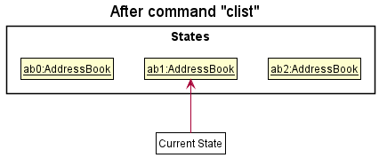

Step 6. The user executes `eclear`, which calls `Model#commitAddressBook()`. Since the `currentStatePointer` is not pointing at the end of the `addressBookStateList`, all address book states after the `currentStatePointer` will be purged. Reason: It no longer makes sense to redo the `add n/David …​` command. This is the behavior that most modern desktop applications follow.

The following activity diagram summarizes what happens when a user executes a new command:

#### Design considerations:

**Aspect: How undo & redo executes:**

* **Alternative 1 (current choice):** Saves the entire address book.
    * Pros: Easy to implement.
    * Cons: May have performance issues in terms of memory usage.

* **Alternative 2:** Individual command knows how to undo/redo by
  itself.
    * Pros: Will use less memory (e.g. for `cdelete`, just save the contact being deleted).
    * Cons: We must ensure that the implementation of each individual command are correct.

### Calendar UI feature

The calendar UI is implemented using the [CalendarFX](https://github.com/dlsc-software-consulting-gmbh/CalendarFX) framework. It can be opened using either the shortcut key `F2`, the file dropdown menu, or the command `calendar`. This feature is mainly facilitated by the `CalendarWindow` class. The `CalendarCommand` class handles the `calendar` command that the user may type and the `MainWindow` class handles the shortcut key and the dropdown menu option for showing the calendar.

#### Design of CalendarWindow

The `CalendarWindow` class extends from `UiPart`, just like the other UI components including the help window. The `CalendarWindow` class instance contains a table of events and the respective entries in the `Calendar` object. There are also final instances of `Calendar` and `CalendarView` objects in a `CalendarWindow` object. See the [CalendarFX manual](https://dlsc.com/wp-content/html/calendarfx/manual.html) for more information on `Calendar` and `CalendarView` classes.

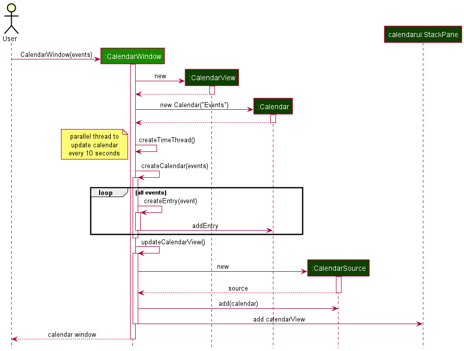

The sequence of how a calendar window is generated is shown in the UML sequence diagram above. The following are the textual descriptions of the diagram:

1. The user intends to open the calendar. The `MainWindow` object captures this intention and calls the constructor of `CalendarWindow` and passes the list of events into it.
2. The `Calendar` and `CalendarView` objects are created and stored. A hashmap of `Event` objects to `Entry` objects is created. (Not shown)
3. A time thread is created to constantly update the current time of the calendar every 10 seconds.
4. The `Calendar` object is populated with the entries of events from Step 1. The hashmap is also concurrently being updated with the events and the associated entries. (Not shown)
5. The `CalendarView` object is updated to include the `Calendar` object, and also to change some configurations to simplify the interface and prevent edits directly on the calendar.
6. The `StackPane` (see `CalendarWindow.fxml`) is updated to include the new `CalendarView` interface. The `CalendarWindow` object is now created and returned to `MainWindow`.

#### Updating the calendar

The user may leave the calendar window open and type in a new command to add, delete, edit or clear the events. In that case, there is a need to constantly update the calendar to reflect the new changes the user has made. This section discusses the implementation of the update and how the updates are optimized.

**Aspect: How the calendar is updated constantly:**

* **Alternative 1 (current choice):** Only updates the event(s) changed by the event commands.
    * Pros: More optimized and faster update for large number of events.
    * Cons: Harder to implement and prone to errors.

:information_source: **Note:** It is important to discuss the `EventChanger` class from `Model` since the implementation of the update feature depends heavily on this class.

The `EventChanger` class contains references to up to 2 `Event` objects - an `oldEvent` and a `newEvent`. It also contains a boolean that is true if the user intends to clear all events. Creating the `EventChanger` object to be passed to the `CalendarWindow` to update the entries is simple, as it can be easily constructed using one of the factory methods: `addEventChanger`, `clearEventChanger`, `deleteEventChanger` and `editEventChanger`. See the class diagram below for a summary of the `EventChanger` class.

Upon the execution of any command, the list of event changers is returned in the `CommandResult`. The list is usually empty, except for the 4 types of commands listed above. The `updateCalendar` method of `CalendarWindow` is then called, which will update the `Calendar` object to remove the `oldEvent` and add the `newEvent` entries. The `Calendar` is cleared if the `EventChanger` is the `clearEventChanger`. This is when the hashmap becomes useful, since the `Entry` objects in the calendar are unique and having the same `Event` associated to the `Entry` does not make the `Entry` objects equal. This will allow deletion of the `Entry` from the calendar.

* **Alternative 2:** Create a new Calendar with all the events for each command executed.
    * Pros: Easy to implement, less code is needed.
    * Cons: Performance can be slowed down if there are many events, even if the user does not make any large change to the events.

This alternative implementation will cause the `MainWindow` class to constantly query the event list in the `AddressBook` through the `Logic` manager every time a command is executed. The queried list is then used to create a new `Calendar` which will be used by the `CalendarWindow` object to display the calendar to the user. However, the performance cost is not feasible if there are many events stored in the `AddressBook`.

--------------------------------------------------------------------------------------------------------------------

## **Documentation, logging, testing, configuration, dev-ops**

* [Documentation guide](Documentation.md)
* [Testing guide](Testing.md)
* [Logging guide](Logging.md)
* [Configuration guide](Configuration.md)
* [DevOps guide](DevOps.md)

--------------------------------------------------------------------------------------------------------------------

## **Appendix: Requirements**

### Product scope

**Target user:** [School of Computing](https://www.comp.nus.edu.sg) (SoC) students who:

* Need to manage large number of contacts and events
* Prefer desktop apps over other types
* Can type fast and prefer typing to mouse interactions
* Are reasonably comfortable using *CLI* apps

**Value proposition**: Manage contacts of peers, *Profs* and events such as classes and Co-Curricular Activities in
a single system faster than a typical mouse/ *GUI* driven app while maintaining user-friendliness

### User stories

Priorities: High (must have) - `* * *`, Medium (nice to have) - `* *`, Low (unlikely to have) - `*`

#### Contacts

| Priority | As a …​                                    | I want to …​                     | So that I can…​                                                        |
| -------- | ------------------------------------------ | ------------------------------ | ---------------------------------------------------------------------- |
| `* * *` | hardworking student | add contact of my *TA*/*Profs* | save their contacts and ask them questions on my modules. |
| `* * *` | careless student | edit the contact of my *TA*/*Profs* | correct mistakes while adding contacts or update my TA contact details |
| `* * *` | senior SoC student | delete the contact of my *TA*/*Profs* | remove contact of my *TA* after I have completed the module |
| `* * *` | SoC student | view the contact of my *TA*/*Profs* | |
| `* * *` | year 4 SoC student with many contacts | search for contact of my *TA*/*Profs* | contact them when necessary |
| `* * *` | CS2103T student | list all the telegram handles of my CS2103T project mates | add them to the project group |   
| `* *` | year 4 SoC student with many contacts | sort the contacts of my *TA* | view the contacts based on the sorting settings |
| `* *` | careless student | undo my last action(s) | recover contacts I accidentally deleted/changed |
| `* *` | organised SoC students | categorize the contacts of students/*TA*/*Profs* | view them separately |
| `* *` | student with many contacts | add the profile picture of *TA*/*Profs* | more easily differentiate my contacts and remember their faces |
| `*` | first time user | import existing contacts from my phone | easily access all my past contacts using SoConnect |
| `*` | long term user | archive some contacts | still save old contacts without cluttering my current screen |

#### Events

| Priority | As a …​                                    | I want to …​                     | So that I can…​                                             |
| -------- | ------------------------------------------ | ------------------------------ | ---------------------------------------------------------------------- |
| `* * *` | SoC student | add details of event | keep track of the CCA dates and time |
| `* * *` | SoC student | delete details of event | remove events that have finished or are cancelled |
| `* * *` | SoC student | edit details of event | update event details |
| `* * *` | SoC student | view all CCA/events | have a rough overview of my schedule | 
| `* * *` | SoC student | search for an event based on event name | easily refer to the event details |
| `* * *` | year 1 SoC student | list addresses of all lectures, tutorials and labs |     
| `* *` | SoC student | sort the events by time | prepare for upcoming events |
| `* *` | SoC student with busy schedule | check if the new event clashes with any of my current events | better plan my timetable and avoid event clashes |
| `* *` | SoC student with busy schedule | see a weekly calendar | easily visualize my schedule for the week |
| `* *` | SoC student with many different events to manage | categorize my events with different tags like classes and CCAs | search related events |
| `*` | SoC student who uses other calendars | import and export my events to other calendars like Google Calendar | synchronize my events across my calendars |
| `*` | long term user | archive some events that have ended | still save details of past events without cluttering my main screen |
| `*` | SoC student with many commitments | have a reminder of upcoming events | |

#### Personalisation and Others

| Priority | As a …​                                    | I want to …​                     | So that I can…​                                             |
| -------- | ------------------------------------------ | ------------------------------ | ---------------------------------------------------------------------- |
| `* * *` | first time user | have a help message I can refer to | understand and start using basic features |
| `*` | first time user | set up my background | personalize the screen to my liking |

### Use cases

(For all use cases below, the **System** is the `SoConnect Application System (SAS)` and the **Actor** is the `user`, unless specified otherwise)

**1. Use case: UC1 - Add contact details**

**Guarantees:** The contact will be stored in the system if and only if the user enters the correct inputs.

***MSS***

1.  User chooses to add *contact information*.

2.  SAS stores the contact and notifies the user that the contact has been successfully added.
    
    Use case ends.

**Extensions**

* 1a. SAS detects an error in the inputs.
  
    * 1a1. SAS requests for correct inputs.
      
    * 1a2. User enters new inputs.
      
    Steps 1a1 to 1a2 are repeated until the inputs entered are correct.
      
    Use case resumes from step 2.
    

* 1b. SAS detects a duplicate contact with the same name.

    * 1b1. SAS gives the user the option of adding the contact anyway.
    
    * 1b2. User proceeds to add the contact.
      
    Use case resumes from step 2.
    
    
* *a. At any time. user chooses not to add the contact.

    Use case ends.

**2. Use case: UC2 - Edit events**

**Preconditions:** There is at least one event in the event list.

**Guarantees:** The event will be updated accordingly if and only if the user enters the correct inputs.

***MSS***

1. User wants to view the list of events.
    
2. User decides on an event to edit.
   
3. User edits the event. 

4. SAS updates the event accordingly and notifies user that the event has been successfully edited.
   
    Use case ends.

**Extensions**

* 3a. SAS detects an error in the inputs.

    * 3a1. SAS requests for correct inputs.

    * 3a2. User enters new inputs.

    Steps 3a1 to 3a2 are repeated until inputs entered are correct.

    Use case resumes from step 4.

* *a. User chooses not to edit the event.

    Use case ends.

**3. Use case: UC3 - Delete contacts**

**Preconditions:** There is at least one contact in the contact list.

**Guarantees:** The contact list will be updated according to which contact(s) are deleted if and only if the user enters the correct inputs.

***MSS***

1.  User wants to view the list of contacts.

2. User decides on the contact(s) to delete.

3. User deletes the contact(s).

4. SAS deletes the specified contact(s), updates the contact list accordingly, and notifies user that the contact(s) has been successfully deleted.
   
    Use case ends.

**Extensions**

* 3a. SAS detects an error in the inputs.

    * 3a1. SAS requests for correct inputs.

    * 3a2. User enters new inputs.

  Steps 3a1 to 3a2 are repeated until inputs entered are correct.

  Use case resumes from step 4.
  

* *a. User chooses not to delete the contact(s).

    Use case ends.

**4. Use case: UC4 - Find contact details**

**Guarantees:** A filtered list of contacts that match the user keywords will be shown, if and only if  the user enters the correct inputs.

***MSS***

1. User decides on the keyword(s) to find.

2. User enters specified keyword(s).

3. SAS shows the matched contacts accordingly and notifies user of search success.

    Use case ends.

**Extensions**

* 2a. SAS fails to find any matched contacts.

    * 2a1. SAS outputs 0 matched contacts.

    * 2a2. User enters new keyword(s).

  Steps 2a1 to 2a2 are repeated until the user finds the contacts of interest.

  Use case resumes from step 3.

* *a. User chooses not to find contact(s).

    Use case ends.

**5. Use case: UC5 - Sort events**

**Preconditions:** List of events to be sorted is displayed.

**Guarantees:** The displayed list of events is sorted lexicographically according to the specified field, if the given field is valid.

***MSS***

1. User decides on a field to sort by.

2. User inputs the specific field.
   
3. SAS sorts the list of events by the specified field provided in step 2.
   
4. SAS displays the sorted list of events.

    Use case ends

**Extensions**

* 2a. SAS detects that the input is an invalid field. 
    
    * 2a1. SAS requests for a correct input.
  
    * 2a2. User enters a new input.
      
    Steps 2a1-2a2 are repeated until user enters a valid field.

    Use case resumes from step 3.

* 2b. SAS detects that the input contains more than one field.
  
    * 2b1. SAS sorts the list by the first field entered. 
      
    Use case resumes from step 4.
    

* *a. User chooses not to sort the list.

    Use case ends.
    

**6. Use case: UC6 - Delete events**

**Preconditions:** There is at least one event in the event list.

**Guarantees:** The event list will be updated according to which event(s) are deleted if and only if the user enters the correct inputs.

***MSS***

1.  User wants to view the list of events.

2. User decides on the event(s) to delete.

3. User deletes the event(s).

4. SAS deletes the specified event(s), updates the event list accordingly, and notifies user that the event(s) has been successfully deleted.

   Use case ends.
   

**Extensions**

* 3a. SAS detects an error in the inputs.

    * 3a1. SAS requests for correct inputs.

    * 3a2. User enters new inputs.

  Steps 3a1 to 3a2 are repeated until inputs entered are correct.

  Use case resumes from step 4.

  
**7. Use case: UC7 - List event fields**

**Preconditions:** There is at least one event in the event list.

**Guarantees:** The displayed list only contains the field(s) of interest, if the given field(s) is / are valid.

***MSS***

1. User decides on a field(s) to be listed.

2. User inputs the specific field(s).

3. SAS displays the list of events with only the field(s) specified shown.

   Use case ends

**Extensions**

* 2a. SAS detects that the input is an invalid field.

    * 2a1. SAS requests for a correct input.

    * 2a2. User enters a new input.

  Steps 2a1-2a2 are repeated until user enters a valid field.

  Use case resumes from step 3.

* 2b. SAS detects that the user did not provide a field.

    * 2b1. SAS displays the default list containing all the fields of the events.

  Use case ends.

* *a. User chooses not to sort the list.

  Use case ends.

**8. Use case: UC8 - Link a specific event to a specific contact**

**Preconditions:** There is at least one event and one contact.

**Guarantees:** The chosen event is linked to the chosen contact.

***MSS***

1. User decides on which event and contact to link.

2. User inputs the event and contact to link.

3. SAS links the chosen event to the chosen contact and notifies user that the event is successfully linked to the contact.

   Use case ends.

**Extensions**

* 2a. SAS detects an error in the inputs.

    * 2a1. SAS requests for correct inputs.

    * 2a2. User enters new inputs.

  Steps 2a1 to 2a2 are repeated until the inputs entered are correct.

  Use case resumes from step 3.

* *a. User chooses not to link event to contact.

**9. Use case: UC9 - Undo a command**

**Guarantees:** SoConnect will be restored to its previous state in its history.

***MSS***

1.  User decides to undo a command.

2.  SAS identifies the previous state of SoConnect and restore it. SAS notifies the user that the previous command is undone.

    Use case ends.

**Extensions**

* 1a. SAS detects that SoConnect does not have a previous state in its history.

    * 1a1. SAS notifies the user that SoConnect is already at its orignal state.

  Use case ends.

**10. Use case: UC10 - Redo a command**

**Guarantees:** SoConnect will be restored to its previously undone state in its history.

***MSS***

1. User decides to undo the previous undo command.

2. SAS redo the command and restores the previously undone state of SoConnect from its history.

   Use case ends.

**Extensions**

* 1a. SAS detects that SoConnect is already at its most recent state.

    * 1a1. SAS notifies the user that there is no previous undo command to redo.

  Use case ends.

### Non-Functional Requirements

1.  Should work on any _mainstream OS_ as long as it has Java `11` or above installed.
2.  Should be able to hold up to 1000 contacts without a noticeable sluggishness in performance for typical usage.
3.  A user with above average typing speed for regular English text (i.e. not code, not system admin commands) should be able to accomplish most of the tasks faster using commands than using the mouse.
4. Should not depend on Internet connection.
5. Only one user should be able to use the system at one time.
6. Should be usable by colorblind students

*{More to be added}*

### Glossary

* **Mainstream OS**: Windows, Linux, Unix, OS-X.

* [**Main Success Scenario**](https://nus-cs2103-ay2122s1.github.io/website/schedule/week7/topics.html#requirements-specifying-requirements-use-cases-details) (MSS): Describes the most straightforward interaction for a given use case, which assumes that nothing goes wrong. 

* **Command Line Interface** (CLI): Text-based user interface.

* **Graphical User Interface** (GUI): Graphic-based user interface.

* **Interface**: The place at which independent and often unrelated systems meet and act on or communicate with each other/ a way for the user to interact with the system.

* **Telegram handle**: Username of a [Telegram](https://telegram.org/) user.

* **Professor** (Prof): A lecturer who teaches a module in NUS.

* **Teaching Assistant** (TA): A student tutor employed to teach small group lessons in NUS.

* **Contact information**: Name and email of the contact. Phone number, address, telegram handle, video conferencing meeting link, and tag(s) are optional.

--------------------------------------------------------------------------------------------------------------------

## **Appendix: Instructions for manual testing**

Given below are instructions to test the app manually.

:information_source: **Note:** These instructions only provide a starting point for testers to work on;
testers are expected to do more *exploratory* testing.

### Launch and shutdown

1. Initial launch

   1. Download the jar file and copy into an empty folder

   1. Double-click the jar file Expected: Shows the GUI with a set of sample contacts. The window size may not be optimum.

1. Saving window preferences

   1. Resize the window to an optimum size. Move the window to a different location. Close the window.

   1. Re-launch the app by double-clicking the jar file. 
       Expected: The most recent window size and location is retained.

1. _{ more test cases …​ }_

### Deleting an event

1. Deleting an event while all events are being shown

   Prerequisites: List all events using the `elist` command. Multiple events in the list.

   2. Test case: `edelete 1` 
      Expected: First event is deleted from the list. Details of the deleted event shown in the status message. Timestamp in the status bar is updated.

   3. Test case: `edelete 0` 
      Expected: No event is deleted. Error details shown in the status message. Status bar remains the same.

   4. Other incorrect delete commands to try: `edelete`, `edelete x`, `...` (where x is larger than the list size) 
      Expected: Similar to previous.

   5. Test case: `edelete 1-2` 
      Expected: First and second event are deleted from the list. Details of the deleted events shown in the status message. Timestamp in the status bar is updated.

   6. Test case: `edelete 2-1` (invalid range) 
      Expected: No event is deleted. Error details shown in the status message. Status bar remains the same.
   
   7. Test case: `edelete 1-x` (where x is larger than the list size) 
      Expected: Similar to previous.

2. _{ more test cases …​ }_

### Saving data

1. Dealing with missing/corrupted data files

   1. _{explain how to simulate a missing/corrupted file, and the expected behavior}_

### Listing all events

1. Listing all event with certain fields shown.

    1. Prerequisites: At least one event in the list.

    1. Test case: `elist at/` 
       Expected: All events listed with only address displayed. All events listed shown in the status message.  
    1. Test case: `elist` 
       Expected: All events listed with all fields displayed. All events listed shown in the status message.

    1. Other incorrect `elist` commands to try: `elist 123`, `elist at/0000`, `elist xyz/` (where xyz is not a valid prefix) 
       Expected: No change in display. Error message shown in status bar.

1. _{ more test cases …​ }_
