SoConnect is a **desktop app for SoC students to manage contacts of Professors and Teaching Assistants,
as well as to keep track of noteworthy events, optimized for use via a _Command Line Interface (CLI)_** while still having
the benefits of a _Graphical User Interface (GUI)_. If you can type fast, SoConnect can get your contact management tasks
done faster than traditional _GUI_ apps.

This User Guide will help you to familiarise yourself with your SoConnect quickly and teach you the
full range of features it offers.

* Table of Contents
{:toc}

--------------------------------------------------------------------------------------------------------------------

## How to use SoConnect User Guide

* You can click on the titles in the Table of Contents to jump the section that you are interested in.
* You will find these icons in this user guide:
    * **:bulb: Tip** provides additional information that might be useful to you.
    * **:information_source: Note** provides supplementary information that helps you to understand this User Guide.
    * **:exclamation: Caution** cautions you against certain actions that will lead to undesirable consequences.
* You can find explanations of _italicised_ words in the [Glossary](#glossary).
* You can refer to the [Command Summary](#command-summary) for a complete overview of all SoConnect features and commands.

### How to read commands in SoConnect

You will see commands throughout this User Guide and each of them have their own _Command Syntax_ format.

This is one example of a command:

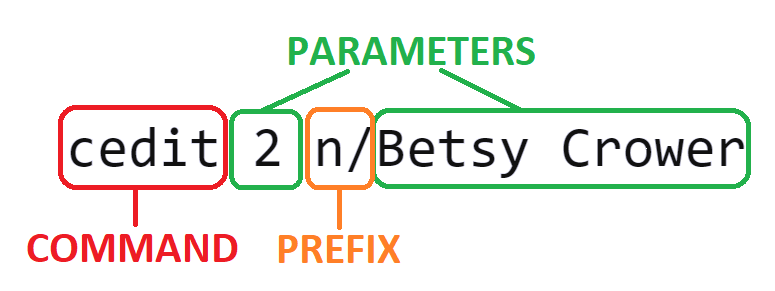

There are only 3 different parts of inputs within each command:
1. **COMMAND WORD**

   Command word is the word that you need to specify when you need SoConnect to perform some actions for you.
   Else, SoConnect does not know how it can help you!

   For example, specifying `cedit` in the command above will tell SoConnect that you want to edit a contact.

2. **_PARAMETER_**

   _Parameter_ is the related information that you need to specify to SoConnect for the action you want to do.

   Using the same example, after telling SoConnect to edit a contact, you will need to tell SoConnect which contact to edit
   and provide the information for the edit.

   Specifying `2` tells SoConnect to edit contact at **index 2** and `Betsy Crower`
   is the **new name** you want to change the specified contact to.

3. **_PREFIX_**

   You can help SoConnect in separating the type of _parameters_ when you input information.

   Each prefix always ends with one `/`. Jump to [List of Prefixes](#list-of-prefixes) to see all prefixes you can use in SoConnect.

   For example, information that you specified after _prefix_ `n/` would help SoConnect to identify the _parameter_
   is referring to **name** of the contact.

Thus, the command above will tell SoConnect to **edit the name of the contact at index 2 to Betsy Crower**.

:bulb: **Tip:**

* Read more on _Command Syntax_ format below, or
* See more commands that you can type in SoConnect [here](#Features)!

**About the _Command Syntax_ format**

We will teach you how to perform certain actions on SoConnect for each [feature](#Features)
you can find in SoConnect.

Here are some information that can help you in understanding the formats at the later section!

* Words in `UPPER_CASE` are the _parameters_ that you will provide. 
  e.g. in `add n/NAME`, `NAME` is a _parameter_ which can be used as `add n/John Doe`.

* _Fields_ in **square brackets** are **optional**. 
  e.g `n/NAME [t/TAG]` can be used as `n/John Doe t/friend` or as `n/John Doe`.

* _Fields_ with `…`​ after them can be used multiple times including zero times. 
  e.g. `[t/TAG]…​` can be used as ` ` (i.e. 0 times), `t/friend`, `t/friend t/family`, etc.

* Each pair of _Prefix_ and _Parameter_ can be in any order. 
  e.g. if the command specifies `n/NAME [p/PHONE_NUMBER]`, `[p/PHONE_NUMBER] n/NAME` is also acceptable.

* If a _parameter_ is expected only once in the command, but you specified it multiple times, **only the last occurrence** of the parameter will be taken. 
  e.g. if you specify `p/12341234 p/56785678`, only `p/56785678` will be taken.

* Extraneous _parameters_ for commands that do not take in _parameters_ (such as `help` and `exit`) will be **ignored**. 
  e.g. if the command specifies `help 123`, it will be interpreted as `help`.

* Date and time must follow **dd-MM-yyyy HH:mm** format.
  e.g. if the date and time is 1 May 2021 6.30pm, you should specify it as `01-05-2021 18:30`

### What happens if my command is invalid?

After you specified a command to be done on SoConnect, a success message will be shown on the message box of SoConnect.

:bulb: **Tip:**

Not sure where is the **message box**? Go to [Overview of SoConnect](#overview-of-soconnect) to check out the different
sections you can find in SoConnect!

For example, after you specified [`clist`](#listing-all-contacts-clist):
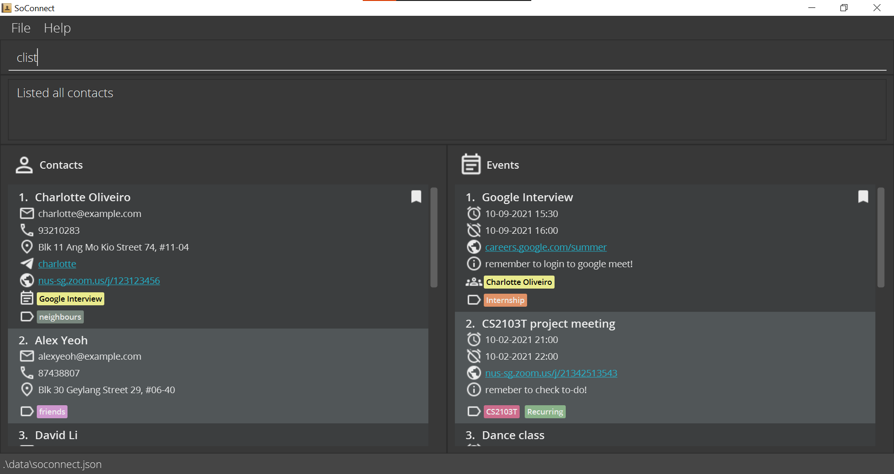
SoConnect will tell you that it has successfully listed all contacts!

 

However, when the command you entered does not fulfill the _Command Syntax_ format specified in [Features](#features),
an **error message** will be shown on the message box instead.

For example, after you specified [`cview`](#viewing-a-contact-cview) **without** specifying which contact to view:
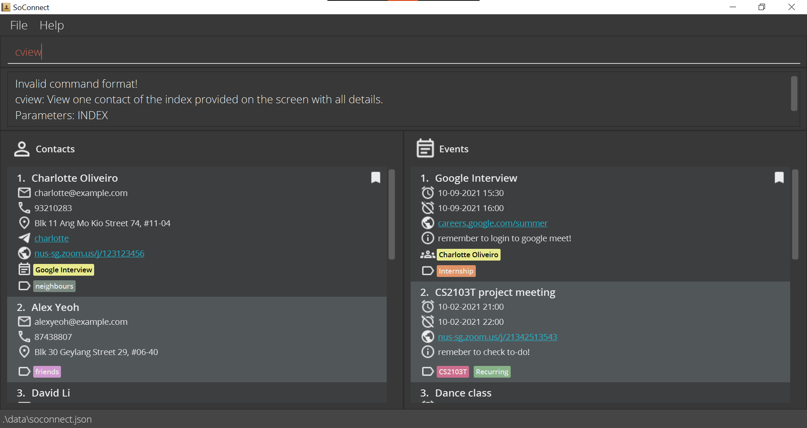
SoConnect will tell you that the _Command Syntax_ format is invalid!

--------------------------------------------------------------------------------------------------------------------
## Quick start

1. Ensure you have [Java 11](https://www.oracle.com/java/technologies/downloads/) or above installed in your Computer.

   
:bulb: **Tip:**

   [Here](https://www.java.com/en/download/help/version_manual.html) is how you can check the Java Version installed in your Computer.
   

2. Download the latest `soconnect.jar` from [here](https://github.com/AY2122S1-CS2103T-W15-3/tp/releases).

3. Copy the file to the folder you want to use as the _home folder_ for your SoConnect.

4. Double-click the file to start SoConnect. This is how SoConnect looks like: 

    
:information_source: **Note:**

   SoConnect comes with some sample contacts and events upon installation!
    

   
   If SoConnect does not start by double-clicking, you can check this [alternative](#how-to-start-soconnect-using-terminal) to start it too.

5. **Type the command in the command box and press Enter** to execute it.

    
:bulb: **Tip:**

   Not sure where is the **command box**? Go to [Overview of SoConnect](#overview-of-soconnect) to check out the different
   sections you can find in SoConnect!
    

   e.g. typing `help` and **pressing Enter** will open the [help window](#help-window-help). 
   Some example commands you can try:

    * `elist`: [Lists all events](#listing-all-events-elist).

    * `cadd n/John Doe p/98765432 e/johnd@example.com a/John street, block 123, #01-01`: [Adds a contact](#adding-a-contact-cadd) named `John Doe` to SoConnect.

    * `cdelete 3` : [Deletes the third contact](#deleting-a-contact-cdelete) shown in SoConnect.

    * `eclear` : [Clears all entries of events](#clearing-all-events-eclear) from SoConnect.

    * `exit` : [Exits](#exiting-soconnect-exit) SoConnect.

6. Refer to the [Features](#features) below for details of each command.

_See also: [What happens if my command is invalid](#what-happens-if-my-command-is-invalid)_

## Overview of SoConnect

This is what you will see when you open SoConnect!
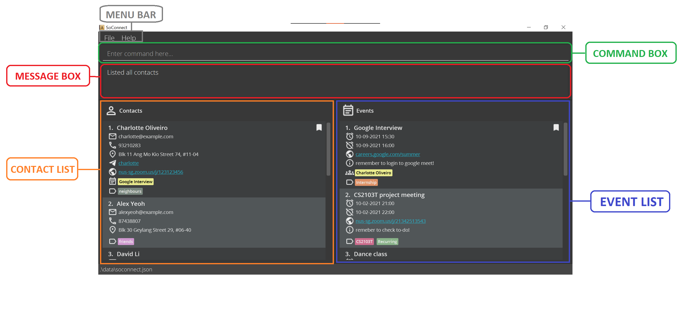

1. **Menu Bar**

   Menu Bar consists if 2 tabs: `File` and `Help`.

   Upon clicking `File`, you can choose to:
    1. **Exit** SoConnect
    2. Open **Calendar** of SoConnect

   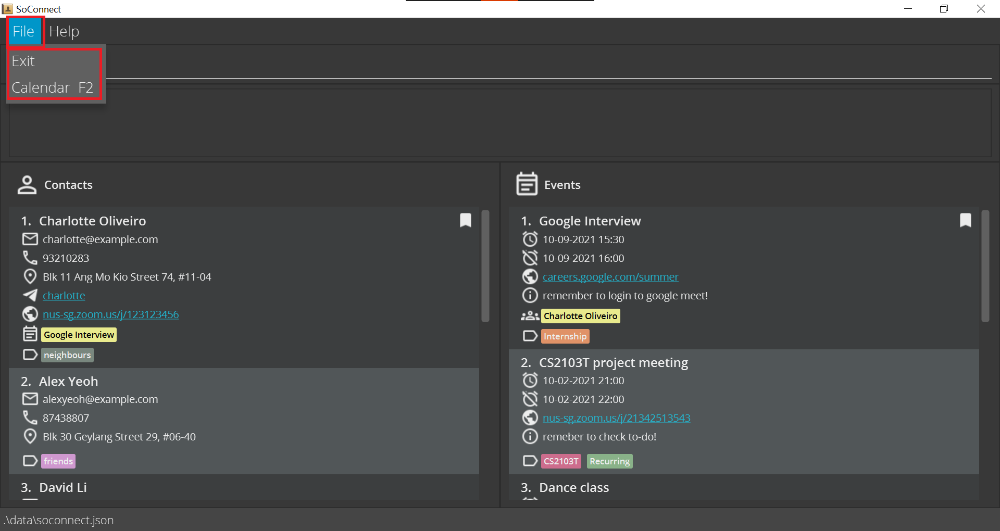

    
:bulb: **Tip:**

   Checkout how to [exit SoConnect](#exiting-soconnect-exit) and open [Calendar](#calendar-window-calendar) of SoConnect using commands!
    
  

   Upon clicking `Help`, you can choose to open **Help Window** of SoConnect.
   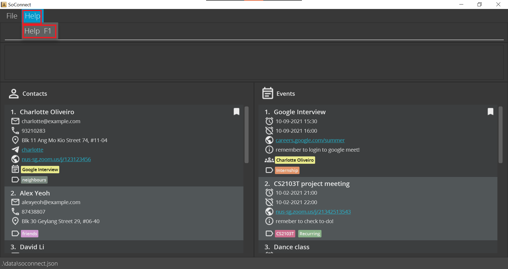

    
:bulb: **Tip:**

   Checkout how to open [Help Window](#help-window-help) of SoConnect using commands!
    

2. **Command Box**

   This is where you can type all your commands to use the [features of SoConnect](#features).

3. **Message Box**

   Displays the message from SoConnect **after** you have executed one command.

   See Also: [What happens if my command is invalid?](#what-happens-if-my-command-is-invalid)

5. **Contact List**

   Displays information of the contacts you saved in SoConnect.

   Refer to [Icons in Contact List](#icons-in-contact-list) to see the different _fields_ that each icon represents in Contact List.

6. **Event list**

   Displays information of the events you saved in SoConnect.

   Refer to [Icons in Event List](#icons-in-events-list) to see the different _fields_ that each icon represents in Event List.

### Icons in Contact List

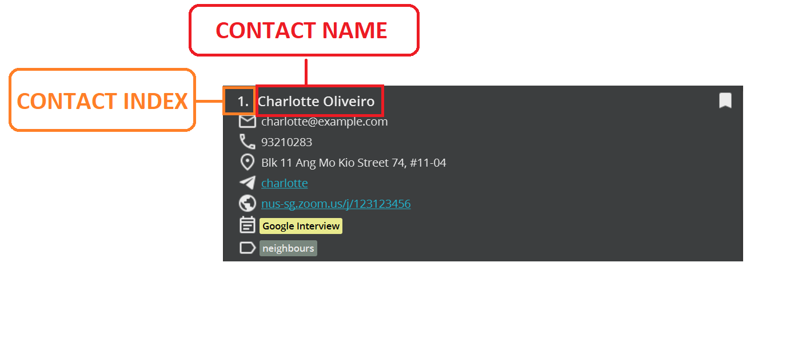
You can always find these 2 information of each contact displayed in SoConnect Contact List:
1. Contact Index
2. Contact Name

Here are the icons you might see under each contact:

Icon | _Field_
--------|------------------
**** | Bookmark*
**** | Email Address
**** | Phone Number
**** | Address
**** | Telegram Handle
**** | Links/ Websites
**** | Linked Events
**** | Tag

*Bookmark icon is only visible when the contact has been bookmarked.
_See also: [Bookmarking a contact](#bookmarking-a-contact-cmark)_

### Icons in Events List

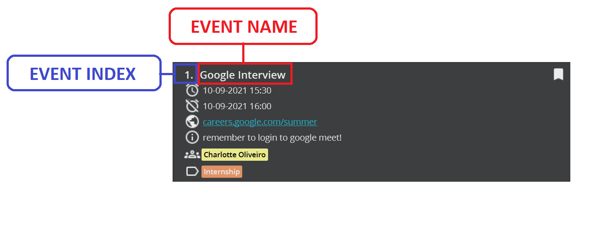
You can always find these 2 information of each contact displayed in SoConnect Event List:
1. Event Index
2. Event Name

Here are the icons you might see under each event:

Icon | _Field_
--------|------------------
**** | Bookmark*
**** | Start Time
**** | End Time
**** | Links/ Websites
**** | Description
**** | Linked Contacts
**** | Tag

*Bookmark icon is only visible when the event has been bookmarked.
_See also: [Bookmarking an event](#bookmarking-an-event-emark)_

--------------------------------------------------------------------------------------------------------------------

## Features

There are three main sections to SoConnect Features:
[Contact Management](#contact-management),
[Event Management](#event-management) and
[General](#general).

For each feature, you are provided with:
* Function and Description of the feature
* Format of _Command Syntax_ of the feature
* Examples of some usages of the feature

## Contact Management

This section details all the features and commands available in SoConnect that can help you with managing your contacts:
* [Adding a contact](#adding-a-contact-cadd)
* [Bookmarking a contact](#bookmarking-a-contact-cmark)
* [Clearing all contacts](#clearing-all-contacts-cclear)
* [Deleting a contact](#deleting-a-contact-cdelete)
* [Editing a contact](#editing-a-contact-cedit)
* [Finding contacts](#finding-contacts-cfind)
* [Listing all contacts](#listing-all-contacts-clist)
* [Removing bookmark of a contact](#removing-bookmark-of-a-contact-cunmark)
* [Viewing a contact](#viewing-a-contact-cview)

### Adding a contact: `cadd`

Adds a contact to SoConnect.

**Format:** `cadd n/NAME e/EMAIL [p/PHONE_NUMBER] [a/ADDRESS] [th/TELEGRAM_HANDLE] [z/ZOOM] [t/TAG]…`

:bulb: **Tip:**
A contact can have any number of tags (including 0)

**Examples:**

Input | Expected Output
------|------------------
`cadd n/Alex Doe e/e0123456@u.nus.edu a/COM1 #99-99 th/johnDoe99 t/Professor` | You should see this message in the message box: `New contact added: Alex Doe; Email: e0123456@u.nus.edu; Address: COM1 #99-99; Telegram: johnDoe99; Tags: [Professor]`    You should also see `Alex Doe` **at the end** of your contact list: 
`cadd n/ Jon Cheng t/TA e/e7654321@u.nus.edu a/COM1-0201 p/87654321 t/Senior th/jonnyjohnny z/https://nus-sg.zoom.us/j/0123456789?pwd=ABCDEFGHIJKLMNOPDJFHISDFSDH` | You should see this message in the message box: `New contact added: Jon Cheng; Email: e7654321@u.nus.edu; Phone: 87654321; Address: COM1-0201; Zoom Link: https://nus-sg.zoom.us/j/0123456789?pwd=ABCDEFGHIJKLMNOPDJFHISDFSDH; Telegram: jonnyjohnny; Tags: [Senior][TA]`   You should also see `Jon Cheng` **at the end** of your contact list: 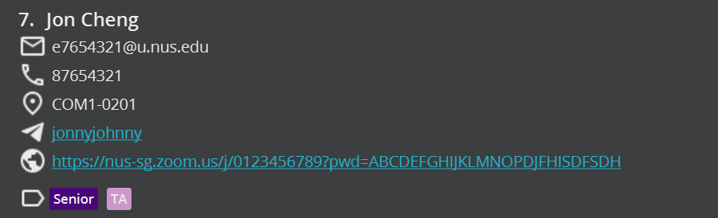

*Index of the newly added contact will depend on your previous number of contacts.

### Bookmarking a contact: `cmark`

Bookmarks the specified contact(s).

**Format:** `cmark INDEX`

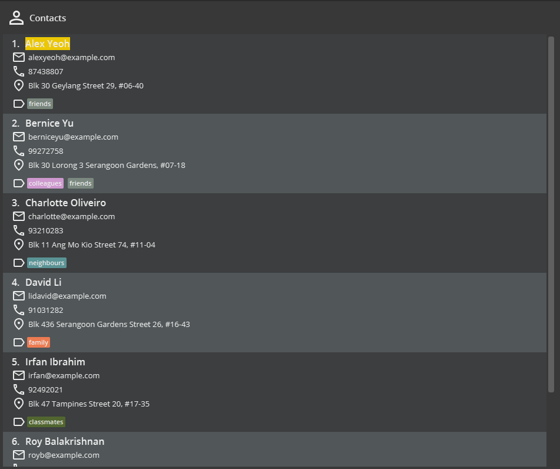

* Bookmarks the contact at `INDEX` and pins it at the top of the contact list.
* `INDEX` refers to the index number shown in the displayed contact list.

:information_source: **Note:**

`INDEX` **must be a positive integer**, e.g. 1, 2, 3,…

**Examples:**

Input | Expected Output
------|------------------
`cmark 2` | Bookmarks the second contact of **currently displayed** contact list in SoConnect.

_See also: [Removing bookmark of a contact](#removing-bookmark-of-a-contact-cunmark)_

### Clearing all contacts: `cclear`

Clears all entries of contacts from SoConnect.

**Format:** `cclear`

:information_source: **Note:**
This will not change the events saved in SoConnect. 

### Deleting a contact: `cdelete`

Deletes the specified contact(s) from SoConnect.

**Format:** `cdelete INDEX1[-INDEX2]`

* Deletes the contact at:
    * the specified `INDEX1` or
    * between the specified range from `INDEX1` to `INDEX2` inclusively (if you provide `INDEX2`).
* `INDEX` refers to the index number shown in the displayed contact list.

:information_source: **Note:**

`INDEX` **must be a positive integer**. e.g. 1, 2, 3, …

**Examples:**
* `clist` followed by `cdelete 2` deletes the second contact from SoConnect.
* `cfind Betsy` followed by `cdelete 1` deletes the first contact from the results of the `cfind` command.
* `cdelete 3-5` deletes contacts from index 3 to 5 from the currently displayed contacts.

### Editing a contact: `cedit`

Edits an existing contact in SoConnect.

**Format:** `cedit INDEX [n/NAME] [e/EMAIL] [p/PHONE] [a/ADDRESS] [th/TELEGRAM_HANDLE] [z/ZOOM] [dt/TAG_DELETED]… [t/TAG_ADDED]… `

* Edits the contact at the specified `INDEX`.
* `INDEX` refers to the index number shown in the displayed contact list.
* You must provide **at least one** of the optional fields.
* Existing values will be updated to the input values.
* You can use `t/` to add a tag.
* You can remove a specific tag by typing `dt/` followed by the tag name that you wish to remove.
* You can remove all existing tags of a contact by typing `dt/*`.
* When editing tags, the tags to be deleted will be removed first, before new tags are added.

:information_source: **Note:**

`INDEX` **must be a positive integer**. e.g. 1, 2, 3, …

**Examples:**
* `clist` followed by `cedit 2 p/91234567 e/agentX@thehightable.com` edits the phone number and email address of the second contact of SoConnect to be `91234567` and `agentX@thehightable.com` respectively.
* `cfind Betsy` followed by `cedit 2 n/Betsy Crower dt/*` edits the name of the second contact from the results of the `cfind` command to be `Betsy Crower` and clears all existing tags.
* `cedit 3 dt/TA`  deletes the `TA` tag from the third contact.
* `cedit 4 dt/*` deletes all tags from the fourth contact.
* `cedit 5 dt/classmate t/friend` first deletes the `classmate` tag, then adds `friend` tag to the fifth contact.

### Finding contacts: `cfind`

Finds all contacts that contain any of the given keywords based on your search type.

**Format:** `cfind [KEYWORD]… [e/KEYWORD…] [p/KEYWORD…] [a/KEYWORD…] [th/KEYWORD…] [z/KEYWORD…] [t/KEYWORD…]`

:bulb: **Tip:**

There are two types of contact searches you can do in SoConnect:
1. If you **do not specify any optional _fields_ before your keywords**, e.g. `cfind KEYWORD1 KEYWORD2`,

   You will only search the names of the contacts based on the keywords you provide.

2. If you specified optional fields before your keyword, e.g. `cfind e/KEYWORD1 p/KEYWORD2`,

   You will search the emails and phone numbers of the contacts based on `KEYWORD1` and `KEYWORD2` respectively.

* You need to provide **at least one keyword**.
* You can provide multiple keywords without specifying any optional _fields_.
* You can only **specify each optional _field_ once**.
* The order of the keywords does not matter. e.g. `Hans Bo` will match `Bo Hans`.
* Partial words can be matched e.g. `Han` will match `Hans`.
* Contact matching at least one keyword will be returned (i.e. _`OR` search_).
  e.g. `Hans Bo` will return `Hans Gruber` and `Bo Yang`.

:information_source: **Note:**

The search by `cfind` is case-insensitive. e.g. `hans` will match `Hans`.

**Examples:**
* `cfind John` returns `john` and `Johnathon Doe`.
* `cfind alex david` returns `Alex Yeoh` and `David Li`.
* `cfind p/123 e/gmail` returns
  contacts with phone numbers that contain `123` and with emails that contain `gmail`.
* `cfind alex david p/123 456` returns `Alex Yeoh`, `David Li` and
  contacts with phone numbers that contain `123` and `456`.

### Listing all contacts: `clist`

Shows all contacts in the SoConnect, with all details by default.

**Format:** `clist [e/] [p/] [a/] [th/] [z/] [t/]`

* Names of contacts are always shown.
* When no optional _fields_ are provided, e.g `clist`, all available details of each contact will be shown.
* When optional _fields_ are provided, it will only show the names and the corresponding specified _fields_ for each contact.
* You can provide more than one optional _field_.
* The order of the optional _fields_ does not matter. e.g. both `clist e/ p/` and `clist p/ e/` will show only the names, email addresses and phone numbers of each contact.
* _Fields_ of a contact that have no value will not appear.

:information_source: **Note:**

Do not add extraneous values after each optional _field_ you specify.

**Examples:**
* `clist` shows all contacts in SoConnect with all available details for each contact.
* `clist e/ p/` shows all contacts in SoConnect with only their names, email addresses and phone numbers (if available).

### Removing bookmark of a contact: `cunmark`

Removes bookmark(s) of the specified contact(s).

**Format:** `cunmark INDEX`

* Removes the bookmark of the contact at `INDEX`.
* `INDEX` refers to the index number shown in the displayed contact list.

:information_source: **Note:**

* `INDEX` **must be a positive integer**, e.g. 1, 2, 3,…
* You must ensure that the contact indexed at `INDEX` is **initially bookmarked**.

**Examples:**
* `cunmark 2` removes the bookmark of the first contact in SoConnect.

_See also: [Bookmarking a contact](#bookmarking-a-contact-cmark)_

### Viewing a contact: `cview`

Views a contact with all details fully shown.

**Format:** `cview INDEX`

* Views the contact at the specified `INDEX`.
* `INDEX` refers to the index number shown in the displayed contact list.
* All truncated details of the contact you want to view will be expanded fully.

:information_source: **Note:**

`INDEX` **must be a positive integer**. e.g. 1, 2, 3, …

**Examples:**
* `cview 2` shows all details of the second contact in SoConnect fully.
* `cfind alex david` followed by `cview 1` shows all details of the first contact from the result of the `cfind`.

## Event Management

This section details all the features and commands available in SoConnect that can help you with managing your events:
* [Adding an event](#adding-an-event-eadd)
* [Bookmarking an event](#bookmarking-an-event-emark)
* [Clearing all event](#clearing-all-events-eclear)
* [Deleting an event](#deleting-an-event-edelete)
* [Editing an event](#editing-an-event-eedit)
* [Finding events](#finding-events-efind)
* [Linking an event to contacts](#linking-an-event-to-contacts-elink)
* [Listing all events](#listing-all-events-elist)
* [Removing bookmark of an event](#removing-bookmark-of-an-event-eunmark)
* [Sorting events](#sorting-events-esort)
* [Unlinking an event from contacts](#unlinking-an-event-from-contacts-eunlink)
* [Viewing an event](#viewing-an-event-eview)

### Adding an event: `eadd`

Adds an event to SoConnect.

**Format:** `eadd n/NAME at/START_TIME [end/END_TIME] [d/DESCRIPTION] [a/ADDRESS] [z/ZOOM] [t/TAG]…​`

:bulb: **Tip:**
An event can have any number of tags (including 0)

:information_source: **Note:**

* Start time and End Time should be of format **dd-MM-yyyy HH:m** (date-MONTH-year HOUR:minute in 24-hour format).
* Ensure the End Time you enter is **chronologically after** the Start Time.

**Examples:**
* `eadd n/Summer Party at/12-12-2021 15:12 a/123, Clementi Rd, 1234665 t/fun`
* `eadd n/CS2103T Lecture at/10-09-2021 16:00 end/10-09-2021 18:00
  z/https://nus-sg.zoom.us/j/0123456789?pwd=ABCDEFGHIJKLMNOPDJFHISDFSDHk t/lecture`

### Bookmarking an event: `emark`

Bookmarks the specified event(s).

**Format:** `emark INDEX`

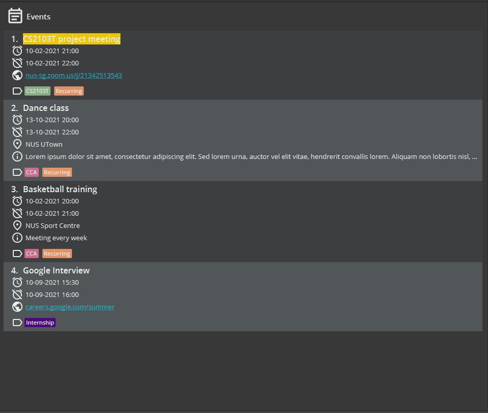

* Bookmarks the event at `INDEX` and pins it to the top of the event list.
* `INDEX` refers to the index number shown in the displayed event list.

:information_source: **Note:**

`INDEX` **must be a positive integer**, e.g. 1, 2, 3,…

**Examples:**
* `emark 2` bookmarks the second event in SoConnect.

_See Also: [Removing bookmark of a contact](#removing-bookmark-of-a-contact-cunmark)_

### Clearing all events: `eclear`

Clears all entries of events from SoConnect.

**Format:** `eclear`

:information_source: **Note:**
This will not change the contacts saved in SoConnect. 

### Deleting an event: `edelete`

Deletes the specified event from SoConnect.

**Format:** `edelete INDEX1[-INDEX2]`

* Deletes the contact at:
    * the specified `INDEX1` or
    * between the specified range from `INDEX1` to `INDEX2` inclusively (if you provide `INDEX2`).
* `INDEX` refers to the index number shown in the displayed event list.

:information_source: **Note:**

`INDEX` **must be a positive integer**. e.g. 1, 2, 3, …

**Examples:**
* `elist` followed by `edelete 2` deletes the second event from SoConnect.
* `efind Exam` followed by `edelete 1` deletes the first event from the results of the `efind` command.
* `edelete 3-5` deletes events from index 3 to 5 from SoConnect.

### Editing an event: `eedit`

Edits an existing event in SoConnect.

**Format:** `eedit INDEX [n/NAME] [at/START_TIME] [end/END_TIME] [d/DESCRIPTION] [a/ADDRESS] [z/ZOOM] [dt/TAG_DELETED]…​ [t/TAG_ADDED]…​`

* Edits the event at the specified `INDEX`.
* `INDEX` refers to the index number shown in the displayed event list.
* You must provide **at least one** of the optional _fields_.
* Existing values will be updated to the input values.
* You can use `t/` to add a tag.
* You can remove a specific tag by typing `dt/` followed by the tag name that you wish to remove.
* You can remove all existing tags of a contact by typing `dt/*`.
* When editing tags, the tags to be deleted will be removed first, before new tags are added.

:information_source: **Note:** 

* `INDEX` **must be a positive integer**. e.g. 1, 2, 3, …
* Start time and End Time should be of format **dd-MM-yyyy HH:mm** (date-MONTH-year HOUR:minute in 24-hour format).

**Examples:**
* `elist` followed by `eedit 2 n/CS2103T Exam dt/Easy_exams t/Hard_exams`
  first changes the name of the second event to `CS2103T Exam`, deletes the tag `Easy_exams` and
  adds the tag `Hard_exams`.
* `efind Betsy` followed by `eedit 2 n/Betsy’s Wedding` edits the name of the second event from the results of the `efind` command to be `Betsy’s Wedding`.
* `eedit 4 dt/*` deletes all existing tags from the fourth event.

### Finding Events: `efind`

Finds all events that contain any of the given keywords based on your search type.

**Format:** `efind [KEYWORDS]… [at/KEYWORD…] [end/KEYWORD…] [d/KEYWORD…] [a/KEYWORD…] [z/KEYWORD…] [t/KEYWORD…]`

:bulb: **Tip:**

There are two types of event searches you can do in SoConnect:
1. If you **do not specify any optional _fields_ before your keywords**, e.g. `efind KEYWORD1 KEYWORD2`,

   You will only search the names of the events based on the keywords you provide.

2. If you specified optional _fields_ before your keyword, e.g. `efind a/KEYWORD1 d/KEYWORD2`,

   You will search the addresses and descriptions of the events based on `KEYWORD1` and `KEYWORD2` respectively.

* You need to provide **at least one keyword**.
* You can provide multiple keywords without specifying any optional _fields_.
* You can only **specify each optional _field_ once**.
* Partial words can be matched e.g. `Exa` will match `CS2103T Exam` .
* Events matching at least one keyword will be returned (i.e. _`OR` search_).
  e.g. `Exam Hard` will return `Hard Exam`, `CS1101S Exams`.

:information_source: **Note:**

The search by `efind` is case-insensitive. e.g. `exams` will match `Exams`.

**Examples:**
* `efind ex` returns `exams` and `Examinations`
* `efind CS Exam` returns `CS2100 Exam`,  `CS2101`
* `efind CS EXAM t/hard easy` returns `CS2100 Exam`, `CS2101` and events with tags that contain `hard` and `easy`

### Linking an event to contacts: `elink`

Links the specified event to one or more contacts.

**Format:** `elink EVENT_INDEX c/CONTACT_INDEX [c/CONTACT_INDEX]…`

* Links the event at `EVENT_INDEX` to the contact(s) at `CONTACT_INDEX`.
* `EVENT_INDEX` refers to the index number shown in the displayed event list.
* `CONTACT_INDEX` refers to the index number shown in the displayed contact list.

:information_source: **Note:**

`EVENT_INDEX` and `CONTACT_INDEX` **must be a positive integer**, e.g. 1, 2, 3,…

**Examples:**
* `elink 1 c/1` links the first event in the displayed event list to the first contact in the displayed contact list.
* `elink 2 c/1 c/2 c/3` links the second event in the displayed event list to the first, second and third contact in the displayed contact list.

_See Also: [Unlinking an event from contacts](#unlinking-an-event-from-contacts-eunlink)_

### Listing all events: `elist`

Shows all events in SoConnect, with all details by default.

**Format:** `elist [at/] [end/] [d/] [a/] [z/] [t/]`

* Names of events are always shown.
* When no optional _fields_ are provided, e.g. `elist` , all available details of each event will be shown.
* When optional _fields_ are provided, it will only show the names and the corresponding specified _fields_ for each event.
* You can provide more than one optional _field_.
* The order of the optional _fields_ does not matter. e.g. both `elist d/ at/` and `elist at/ d/` will only show the names, descriptions and starting times of each event.
* _Fields_ of an event that have no value will no appear.

:information_source: **Note:**

Do not add extraneous values after each optional _field_ you specify.

**Examples:**
* `elist` shows all events in SoConnect with all available details for each event.
* `elist d/ at/` events in SoConnect with only their names, starting times and descriptions (if available).

### Removing bookmark of an event: `eunmark`

Removes bookmark of the specified event(s).

**Format:** `eunmark INDEX`

* Removes bookmark of the event at `INDEX`.
* `INDEX` refers to the index number shown in the displayed event list.

:information_source: **Note:**

* `INDEX` **must be a positive integer**, e.g. 1, 2, 3,…
* You must ensure that the event indexed at `INDEX` is **initially bookmarked**.

**Examples:**
* `eunmark 2` removes the bookmark of the first event in SoConnect.

_See Also: [Bookmarking an event](#bookmarking-an-event-emark)_

### Sorting events: `esort`

Sorts all events by start time and displays all upcoming or ongoing events.

**Format:** `esort`

**Examples:**
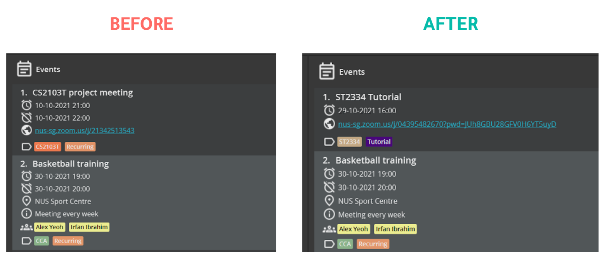

:information_source: **Note:**

Events that have ended **will not be shown** after you execute `esort`

### Unlinking an event from contacts: `eunlink`

**Format:** `eunlink EVENT_INDEX c/CONTACT_INDEX [c/CONTACT_INDEX]…`

Unlinks the specified event and the specified contact(s).

**Examples:**
* `eunlink 1 c/1` unlinks the first event in the displayed event list from the first contact in the displayed contact list.
* `eunlink 2 c/1 c/2 c/3` unlinks the second event in the displayed event list from the first, second and third contacts in the displayed contact list.
* `eunlink 3 c/*` unlinks the third event in the displayed event list from all contacts that are linked to it.

_See Also: [Linking an event to contacts](#linking-an-event-to-contacts-elink)_

### Viewing an event: `eview`

Views an event with all details fully shown.

**Format:** `eview INDEX`

* Views the event at the specified `INDEX`.
* `INDEX` refers to the index number shown in the displayed event list.
* All truncated details of the event you want to view will be expanded fully.

:information_source: **Note:**

`INDEX` **must be a positive integer**. e.g. 1, 2, 3, …

**Examples:**
* `eview 1` shows all details of the first event in SoConnect fully.
* `efind exam` followed by `eview 4` shows all details of the fourth event from the result of the `cfind`.

## General

This section details all other the features and commands available in SoConnect that can enhance your SoConnect experience:
* [Calendar Window](#calendar-window-calendar)
* [Exiting SoConnect](#exiting-soconnect-exit)
* [Help Window](#help-window-help)
* [Redo a command](#redo-a-command-redo)
* [Undo a command](#undo-a-command-undo)

### Calendar Window: `calendar`

Shows a calendar of all the events.

**Format:** `calendar`

* You can view the calendar in 4 different views:
    * Daily
    * Weekly
    * Monthly
    * Yearly
      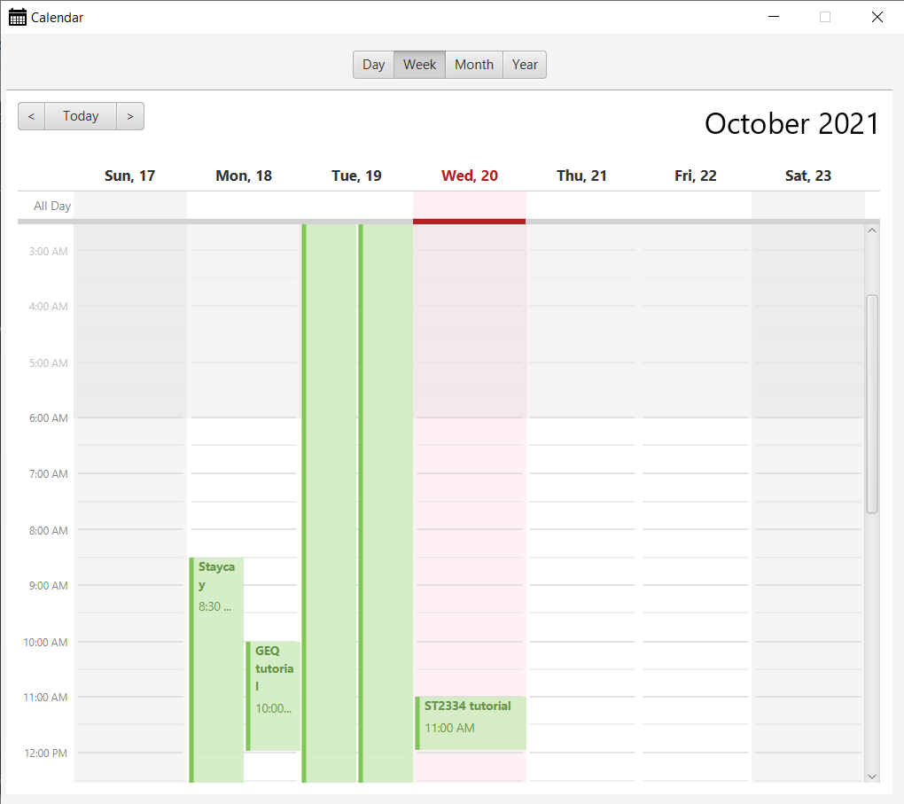

:bulb: **Tip:**

Alternatively, you can view the calendar using the top menu bar via `File -> Calendar` or press `F2`.

:exclamation: **Caution:**
Any changes made in the calendar window will not be saved. 
Do not attempt to add new events using the calendar window. 
Doing so might result in a crash and your data may be lost.

### Exiting SoConnect: `exit`

Exits and closes SoConnect.

**Format:** `exit`

:bulb: **Tip:**

Alternatively, you can exit SoConnect using the top menu bar via `File -> Exit`.

### Help Window: `help`

Displays a summary of all commands in SoConnect User Guide.

**Format:** `help`

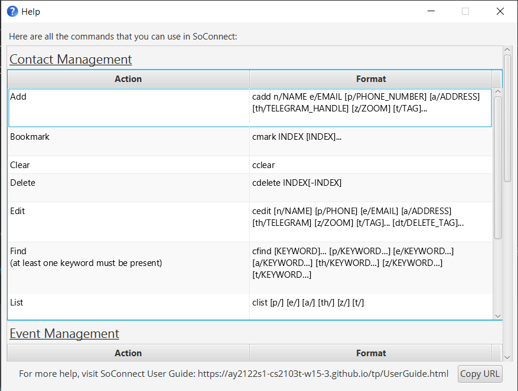

:bulb: **Tip:**

Alternatively, you can view the help window using the top menu bar via `Help -> Help` or press `F1`.

### Redo a command: `redo`

Restores SoConnect to a previously undone state from its history.

**Format:** `redo`

**Examples:**
* `edelete 1` followed by `undo` restores the deleted event in the event list. This followed by `redo` command will delete the event at index 1 again.

_See Also: [Undo a command](#undo-a-command-undo)_

### Undo a command: `undo`

Restores SoConnect to its previous state from its history.

**Format:** `undo`

**Examples:**
* `edelete 1` followed by `undo` restores the deleted event in the event list.
* `add n/John Doe e/john@gmail.com` followed by `undo` removes the added contact from contact list.
* `eview 1` followed by `undo` will display the full event list.

_See Also: [Redo a command](#redo-a-command-redo)_

--------------------------------------------------------------------------------------------------------------------

## SoConnect Saved Data

### Saving the data

SoConnect data is saved in the _hard disk_ automatically after any command that changes the data.
There is no need to save manually.

### Editing the data file

SoConnect data are saved as a _JSON file_ `[JAR file location]/data/soconnect.json`.
Advanced users are welcome to update data directly by editing that data file.

:exclamation: **Caution:**
If your changes to the data file makes its format invalid, 
SoConnect will discard all data and start with an empty data file at the next run.

--------------------------------------------------------------------------------------------------------------------

## Others

### FAQ

**Q**: How do I transfer my data to another Computer? 
**A**: Install SoConnect in the other computer and copy over the contents from your previous SoConnect _JSON file_ to the
empty data file SoConnect creates on the other Computer.

#### Copying Details and Opening Links

**Q**: How do I copy the email address of a contact? 
**A**: You can copy any specific details of a contact or an event just by clicking on that detail!  
As shown on the image above, clicking on the `email` of `Charlotte Oliveiro` will copy her Email Address.

**Q**: Can SoConnect automatically open a link on my browser? 
**A**: YES! You can open any links that you have included in a contact or in an event. 

:bulb: **Tip:**

Clickable links are underlined in blue

Referring back to the same image, if you click on the `zoom` link saved under `Charlotte Oliveiro`,
SoConnect will help you open the link on your browser automatically.

#### Linked Contacts and Events

**Q**: How do I view the contacts linked to a particular event? 
**A**: Click on the particular event card in the panel containing events.
Then click on the yellow boxes which are links to the contacts.
The linked contacts will be displayed on the contact panel on the left.
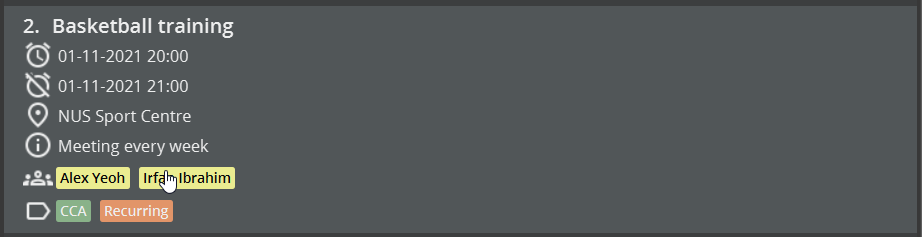

**Q**: How do I view the events linked to a particular contact? 
**A**: Click on the particular contact card in the panel containing contacts.
Then click on the yellow boxes which are links to the events.
The linked events will be displayed on the event panel on the left.
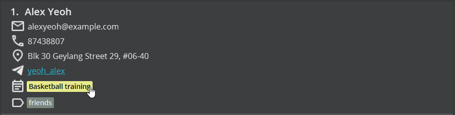

**Q**: What is the purpose of using links? 
**A**: Links are a form of relationship between the contacts and the events saved in SoConnect.
Typically, we link an event to a contact if the contact is involved as a participant of the event.
For instance, you can link your professor to the lecture.

### How to start SoConnect using Terminal

1. Open the terminal (For [MacOS](https://support.apple.com/en-sg/guide/terminal/welcome/mac) or Linux)
   or Command Prompt (For [Windows](https://www.howtogeek.com/235101/10-ways-to-open-the-command-prompt-in-windows-10/)).

2. Navigate to the folder containing `soconnect.jar`.
   See the tutorial for [Windows](https://www.howtogeek.com/659411/how-to-change-directories-in-command-prompt-on-windows-10/),
   [MacOS or Linux](https://www.macworld.com/article/221277/command-line-navigating-files-folders-mac-terminal.html)
   (Linux uses the same command for navigating folders).

3. Enter the following command: `java -jar soconnect.jar`. The SoConnect window should open.

:bulb: **Tip:**

* If you are still unable to open the file,
  [check your Java version](https://www.java.com/en/download/help/version_manual.html)
  again and make sure it is version 11.
* [Download Java 11](https://www.oracle.com/java/technologies/downloads/) if you have not done so.

--------------------------------------------------------------------------------------------------------------------
## List of Prefixes

**Contact Management**

_Prefix_ | _Parameter_ Type
--------|------------------
**`a/`** | Address
**`dt/`** | Tag to be deleted
**`e/`** | Email Address
**`n/`** | Name
**`p/`** | Phone Number
**`t/`** | Tag
**`th/`** | Telegram Handle
**`z/`** | Links/ Websites

**Event Management**

_Prefix_ | _Parameter_ Type
--------|------------------
**`a/`** | Address
**`at/`** | Start Date and Time
**`c/`** | Contact index
**`d/`** | Description
**`dt/`** | Tag to be deleted
**`end/`** | End Date and Time
**`n/`** | Name
**`t/`** | Tag
**`z/`** | Links/ Websites

## Command Summary

**Contact Management**

Action | Format, Examples
--------|------------------
**[Add](#adding-a-contact-cadd)** | `cadd n/NAME e/EMAIL [p/PHONE_NUMBER] [a/ADDRESS] [th/TELEGRAM_HANDLE] [z/ZOOM] [t/TAG]…​`   e.g., `cadd n/James Ho p/22224444 e/hohohojames@u.nus.edu a/123, Clementi Rd, 1234665 t/Professor`
**[Bookmark](#bookmarking-a-contact-cmark)** | `cmark INDEX`  e.g. `cmark 1`
**[Clear](#clearing-all-contacts-cclear)** | `cclear`
**[Delete](#deleting-a-contact-cdelete)** | `cdelete INDEX1[-INDEX2]`  e.g. `cdelete 3`   e.g. `cdelete 1-5`
**[Edit](#editing-a-contact-cedit)** | `cedit INDEX [n/NAME] [e/EMAIL] [p/PHONE] [a/ADDRESS] [th/TELEGRAM_HANDLE] [z/ZOOM] [dt/TAG_DELETED]…​ [t/TAG_ADDED]…​​`  e.g.`cedit 2 n/James Lee e/jameslee@u.nus.edu p/91234567 dt/OP1_projectmate t/CS2103T_projectmate t/roommate`   e.g. `cedit 3 dt/*`
**[Find](#finding-contacts-cfind)** | `cfind [KEYWORD]… [e/KEYWORD…] [p/KEYWORD…] [a/KEYWORD…] [th/KEYWORD…] [z/KEYWORD…] [t/KEYWORD…]`  e.g. `cfind James Jake p/12345678`
**[List](#listing-all-contacts-clist)** | `clist [e/] [p/] [a/] [th/] [z/] [t/]`   e.g. `clist`   e.g. `clist e/ p/`
**[Remove Bookmark](#removing-bookmark-of-a-contact-cunmark)** | `cunmark INDEX`  e.g. `cunmark 4`
**[View](#viewing-a-contact-cview)** | `cview INDEX`  e.g. `cview 3`

**Event Management**

Action | Format, Examples
--------|------------------
**[Add](#adding-an-event-eadd)** | `eadd n/NAME at/START_TIME [end/END_TIME] [d/DESCRIPTION] [a/ADDRESS] [z/ZOOM] [t/TAG]…​ `   e.g., `eadd n/Summer Party at/12-12-2021 15:12 a/123, Clementi Rd, 1234665 t/fun`
**[Bookmark](#bookmarking-an-event-emark)** | `emark INDEX`  e.g. `emark 1`
**[Clear](#clearing-all-events-eclear)** | `eclear`
**[Delete](#deleting-an-event-edelete)** | `edelete INDEX`  e.g., `edelete 3`   e.g., `edelete 1-5`
**[Edit](#editing-an-event-eedit)** | `eedit INDEX [n/NAME] [at/START_TIME] [end/END_TIME] [d/DESCRIPTION] [a/ADDRESS] [z/ZOOM] [dt/TAG_DELETED]…​ [t/TAG_ADDED]…​`  e.g.,`eedit 2 n/CS2103T Exam dt/Easy_exams t/Hard_exams`   e.g., `eedit 3 dt/*`
**[Find](#finding-events-efind)** | `efind [KEYWORDS]… [at/KEYWORD…] [end/KEYWORD…] [d/KEYWORD…] [a/KEYWORD…] [z/KEYWORD…] [t/KEYWORD…]`   e.g., `efind CS2103T t/hard`
**[Link](#linking-an-event-to-contacts-elink)** | `elink EVENT_INDEX c/CONTACT_INDEX [c/CONTACT_INDEX]...`  `elink 2 c/1 c/2 c/3`
**[List](#listing-all-events-elist)** | `elist [at/] [end/] [d/] [a/] [z/] [t/]`   e.g., `elist`   e.g., `elist at/ d/`
**[Remove Bookmark](#removing-bookmark-of-an-event-eunmark)** | `eunmark INDEX`  e.g. `eunmark 4`
**[Sort](#sorting-events-esort)** | `esort`
**[Unlink](#unlinking-an-event-from-contacts-eunlink)** | `eunlink EVENT_INDEX c/CONTACT_INDEX [c/CONTACT_INDEX]...`  e.g., `eunlink 2 c/1 c/2`   e.g., `eunlink 3 c/*`
**[View](#viewing-an-event-eview)** | `eview INDEX`  e.g. `eview 1`

**General**

Action | Format, Examples
--------|------------------
**[Calendar](#calendar-window-calendar)** | `calendar`
**[Exit](#exiting-soconnect-exit)** | `exit`
**[Help](#help-window-help)** | `help`
**[Redo](#redo-a-command-redo)** | `redo`
**[Undo](#undo-a-command-undo)** | `undo`

________________________________________________________________________________________________________________

## Glossary

Word | Explanation
--------|------------------
**Command Line Interface (CLI)** | Text-based application where user interact with the application by **typing in texts/ commands**
**Command Syntax** | The structure that a command must abide by for it to be executed
**Field(s)** | The information type within each contact or event   For example, **Name** and **Address** of a contact are _fields_ of a contact.
**Graphical User Interface (GUI)** | Graphical representation of the application that the user sees
**Hard Disk** | Device in computer that is used to save files of the computer
**Home Folder** | Folder which the application file is saved in the computer
**JavaScript Object Notation (JSON) File** | The file that is used by the application to load its data and to save data of the application in a human-readable format.
**OR Search** |
**Parameter(s)** | Information supplied by the user to the application when executing certain commands 
